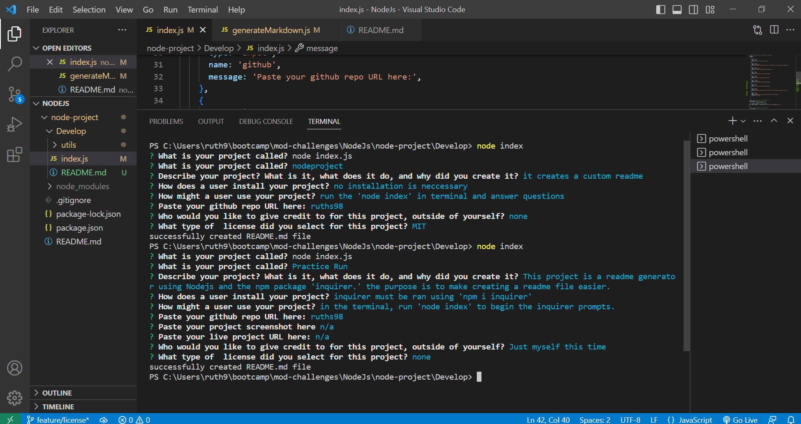
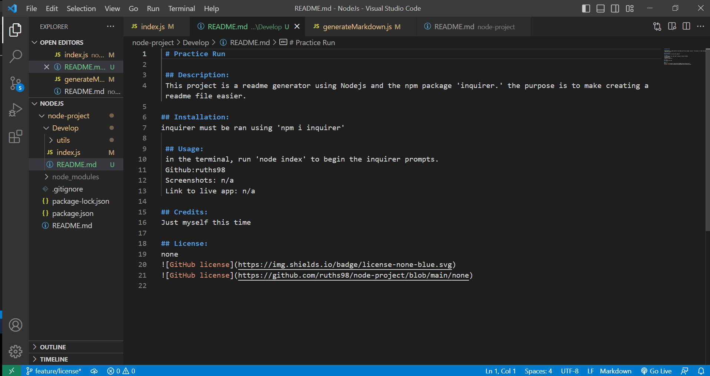

# Readme Generator
 
 ## Description:
 Using Nodejs and the npm module 'inquirer' we will the user to create a custom readme easily.

## Installation:
run 'npm inquirer' in the terminal to install inquirer.

 ## Usage:
 they will open the files and run 'node index' to begin the prompts. Once the prompts have been completed, a README.md file will be generated using their answers.
 There is no deployed application but the repository link is on github.
 Github:https://github.com/ruths98/node-project
 
 
 Link to demonstration video: https://drive.google.com/file/d/11dp19v8afqw_Gy-Uytpy_QQJbUSrD9hi/view

## Credits:
this npm module was used: https://www.npmjs.com/package/inquirer
Starter code was provided by https://github.com/coding-boot-camp/potential-enigma

## License:
none

  